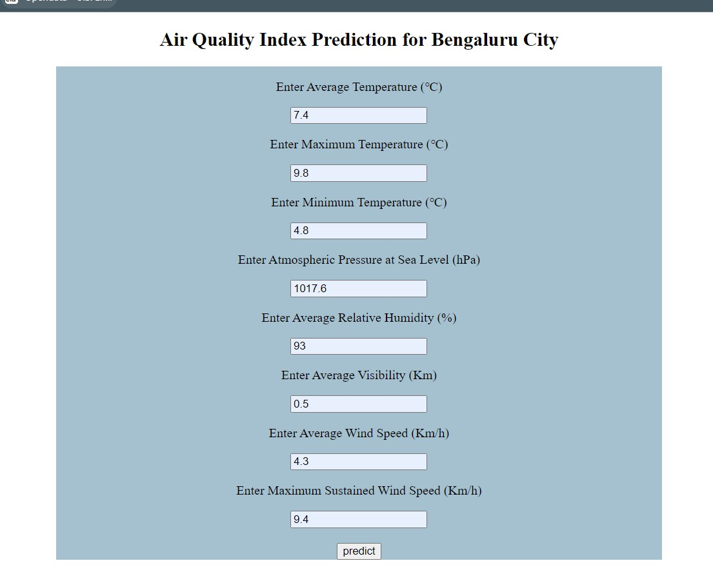
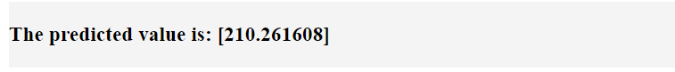

# Air Quality Index Prediction
## Overview
Air pollution forecasting uses science and technology to predict the composition of air pollution in a specific location and time. It commonly relies on indicators like the air quality index or PM2.5 concentration to determine pollution levels.

"Particulate Matter 2.5." PM2.5 refers to fine particulate matter that consists of particles with a diameter of 2.5 micrometers or smaller. These particles can be solid or liquid and are suspended in the air. PM2.5 is a significant air pollutant and is commonly used as an indicator of air quality.

## Motivation
After learning various algorithms of classification and regression it is important to work on real world application to actually make a difference.
It involves dealing with noisy, incomplete, or unstructured data, and require considering various factors like data preprocessing, feature selection, model selection, and performance evaluation.

## Data Collection and Preprocessing
I have collected the data through web scrapping(using the BeautifulSoup library) from a website 'en.tutiempo.net'.

After extracting the data I  applied different data preprocessing techniques such as handling missing values, encoding, standardization, etc. The cleaned data is stored in the 'Real_Combine.csv' file.

## Model Training

The dataset is trained by various regression algorithms and Random Forest accuracy is best among them.

## 


## Screenshots





## Libraries and Frameworks

**Libraries:** numpy, pandas, scikit learn, matplot, scipy, BeautifulSoup

**IDE:** Jupyter, VsCode

**Framework:** Flask, Heroku


## Installation and Run
Follow following commands:

```bash
 Step 1: pip install -r requirements.txt
```
```bash
 Step 2: python app.py
```
    